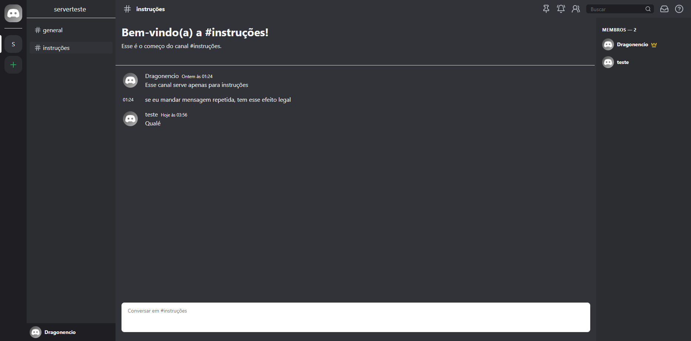
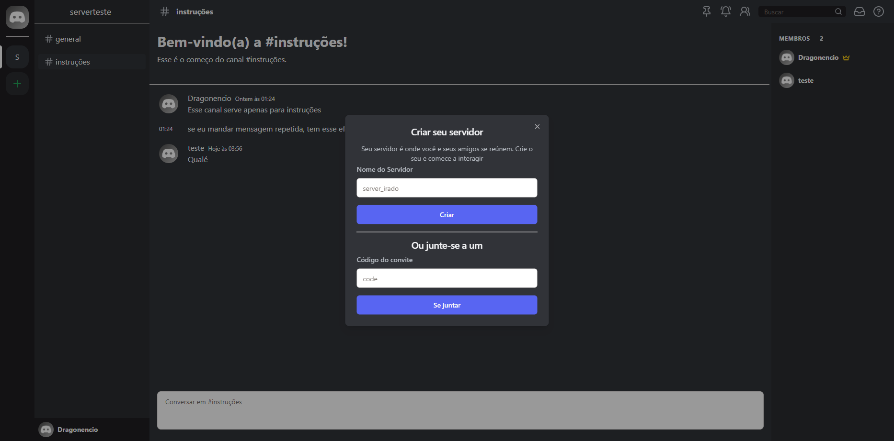

# Discordia - App de Chat (que talvez seja igual ao discord)

## Descrição

Repositório das aplicações back-end e front-end do projeto de chat em tempo real.

## Stack utilizada

**Front-end:** ReactJS, Typescript, Redux, ShadcnUI

**Back-end:** NodeJS, Typescript, SocketIO, MongoDB

## Ordem recomendada de execução

* Back-end Nest.js
* Front-end Next.js

## Rodando o projeto

Suba o container do MongoDB no repositório do back-end:

```bash
$ docker-compose up -d
```

Em seguida, inicie o backend com o comando:

```bash
$ npm run dev
```

E por último, no repositório do front-end:

```bash
$ npm run dev
```

## Funcionalidades

- Criação e login de usuários
- Criação de servidores e canais
- Envio de convites para o servidor
- Envio de mensagens em tempo real


